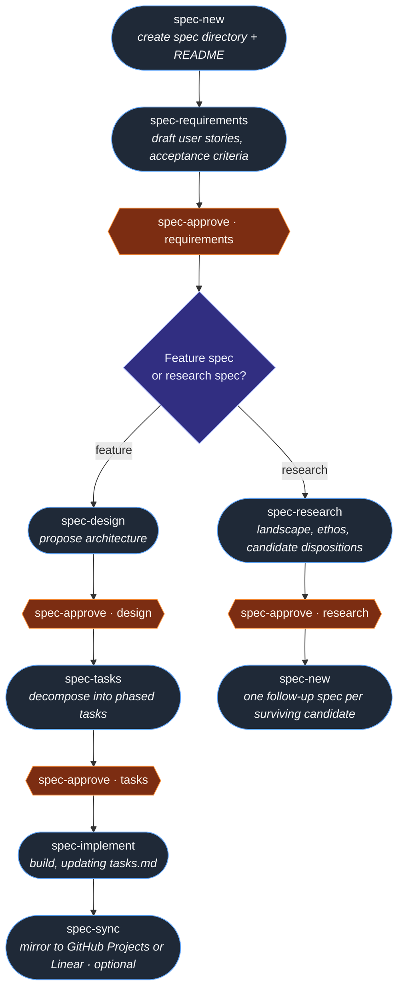

# Claude Spec-Driven SDLC

<p align="center">
  <strong>Syncs with</strong><br/>
  <a href="#linear-setup"></a>
  <a href="#github-setup"></a>
</p>

**The future of software development isn't AI writing code for you—it's AI thinking alongside you.**

Traditional SDLC demands extensive documentation, architecture reviews, and project management overhead. Most teams skip it. They jump straight to code, accumulate tech debt, and wonder why projects fail. The discipline exists for good reasons, but the friction is too high.

**AI-led SDLC changes everything.**

```
┌─────────────────────────────────────────────────────────────────────────────┐
│                                                                             │
│   Traditional SDLC                    AI-Led SDLC                           │
│   ─────────────────                   ───────────────                       │
│   Write specs alone (hours)     →     Collaborative spec generation (mins)  │
│   Architecture reviews (days)   →     Instant design validation             │
│   Manual task breakdown         →     Intelligent task decomposition        │
│   Context lost between phases   →     Perfect context preservation          │
│   Documentation as afterthought →     Documentation as the process          │
│   Solo developer bottleneck     →     AI pair throughout lifecycle          │
│                                                                             │
└─────────────────────────────────────────────────────────────────────────────┘
```

## The Paradigm Shift

This isn't just automation—it's **augmentation**. Claude becomes your:

- **Requirements Analyst**: Asks the right questions, identifies edge cases you'd miss, structures your thoughts into formal specifications
- **Solutions Architect**: Proposes architectures, evaluates trade-offs, documents decisions with rationale
- **Technical Writer**: Generates comprehensive documentation that stays in sync with your evolving understanding
- **Project Manager**: Breaks work into phases, identifies dependencies, tracks progress
- **Implementation Partner**: Executes tasks systematically while you maintain creative control

**You stay in the driver's seat.** Every phase requires your explicit approval before proceeding. The AI proposes, you dispose.

## Why This Matters

```
Idea → Requirements → Design → Tasks → Implementation
        ↑              ↑         ↑         ↑
     [Approve]     [Approve]  [Approve]  [You Code]
```

Most developers know they *should* write specs. They don't because:
- It's tedious and time-consuming
- Requirements feel obvious (until they're not)
- Design docs get stale immediately
- The overhead doesn't feel worth it for "small" features

**AI-led SDLC removes these excuses.** When generating a comprehensive requirements doc takes a conversation instead of a day, you'll actually do it. When the AI remembers every decision and context from requirements through implementation, nothing gets lost.

The result: **Enterprise-grade engineering discipline at startup speed.**

## How It Works: Skills

This toolkit ships as a set of **[Anthropic Skills](https://agentskills.io/specification)** — discrete capabilities Claude loads based on what you ask for. There are no slash commands to memorize. Describe what you want; Claude picks the right skill.

| Skill | Triggers when you say... |
|---|---|
| `spec-new` | "create a new spec for X", "start a spec called X" |
| `spec-requirements` | "draft requirements", "write the requirements doc" |
| `spec-design` | "design this", "draft the design doc" |
| `spec-research` | "do the research", "competitive scan", "evaluate candidates" |
| `spec-tasks` | "generate tasks", "break this down" |
| `spec-implement` | "start implementation", "begin building", "implement phase 2" |
| `spec-approve` | "approve requirements", "approve the design" |
| `spec-review` | "review the design", "audit the requirements" |
| `spec-status` | "show all specs", "what's the status" |
| `spec-switch` | "switch to spec 003", "work on the auth spec instead" |
| `spec-sync` | "sync to Linear", "push tasks to GitHub Projects" |
| `spec-update-task` | "mark T-12 done", "I finished the auth task" |

Each phase-authoring skill (`spec-design`, `spec-tasks`, `spec-implement`, `spec-research`) checks for the previous phase's approval marker before proceeding, so the workflow can't skip steps.

## Quick Start

### Prerequisites

- [Claude Code CLI](https://docs.anthropic.com/en/docs/claude-code) installed and configured
- Git repository for your project
- (Optional) [GitHub CLI](https://cli.github.com/) for GitHub Projects sync
- (Optional) [Linear API key](https://linear.app/settings/api) for Linear sync
- (Optional) `jq` and `curl` for Linear API scripts

### Installation

```bash
# Option 1: Clone into your existing project and install skills
git clone https://github.com/dugleelabs/claude-spec-driven-sdlc.git .claude-sdlc
mkdir -p .claude/skills
cp -r .claude-sdlc/skills/spec-* .claude/skills/
cp -r .claude-sdlc/scripts .claude/    # required for project tracker sync

# Option 2: Install user-wide (all your projects)
git clone https://github.com/dugleelabs/claude-spec-driven-sdlc.git ~/claude-spec-driven-sdlc
mkdir -p ~/.claude/skills
cp -r ~/claude-spec-driven-sdlc/skills/spec-* ~/.claude/skills/

# Option 3: Use as a standalone spec repository
git clone https://github.com/dugleelabs/claude-spec-driven-sdlc.git my-project-specs
cd my-project-specs
```

Claude Code auto-discovers skills from `.claude/skills/` (project) and `~/.claude/skills/` (user) on startup.

### Your First Spec

Just describe what you want — Claude picks the right skill at each step:

```
You:    Let's create a spec for user authentication.
        → spec-new fires, creates spec/001-user-authentication/

You:    Draft the requirements. It uses email + password, with a TOTP option later.
        → spec-requirements fires, drafts requirements.md (asks clarifying questions)

You:    Review the requirements.
        → spec-review fires with phase=requirements, returns a verdict

You:    Looks good — approve requirements.
        → spec-approve fires, sets .requirements-approved

You:    Now write the design.
        → spec-design fires, drafts design.md

You:    Approve the design and generate tasks.
        → spec-approve → spec-tasks fires

You:    Approve tasks and let's start implementing phase 1.
        → spec-approve → spec-implement fires
```

## The Workflow



**Rounded nodes** are skills Claude invokes. **Hex gates** (`spec-approve · …`) are human checkpoints — no phase advances without one. **The diamond** is the only fork: feature specs ship code, research specs ship decisions and spawn follow-up specs.

`spec-review` and `spec-status` can run at any time and are omitted from the main path. `spec-switch` and `spec-update-task` are housekeeping skills, also off-path.

## Skills Reference

| Skill | Description |
|---|---|
| `spec-new` | Create a new feature specification directory |
| `spec-requirements` | Draft or revise the requirements document |
| `spec-design` | Draft technical design (feature specs) |
| `spec-research` | Draft research report (competitive analysis, ethos, dispositions) |
| `spec-tasks` | Generate the implementation task list |
| `spec-implement` | Begin or continue implementation |
| `spec-approve` | Approve a phase (requirements \| design \| research \| tasks) |
| `spec-review` | Self-audit a phase document and return a verdict |
| `spec-status` | Show all specs and their progress |
| `spec-switch` | Change the active specification |
| `spec-update-task` | Mark a single task complete |
| `spec-sync` | Sync approved tasks to GitHub Projects or Linear |

Full skill definitions live in [`skills/`](skills/). Each skill is a self-contained `SKILL.md` (plus optional `references/` for long-form guidance) following the [Agent Skills specification](https://agentskills.io/specification).

## What Gets Generated

Each spec produces three documents — `requirements.md`, `design.md`, and `tasks.md` — that build on each other through the workflow phases. See [docs/generated-artifacts.md](docs/generated-artifacts.md) for full details on what each contains.

### Research specs (alternate variant)

Not every spec ships code. Competitive analyses, roadmap research, strategy reviews, and architecture spikes produce **decision documents**, not implementations. For these, ask Claude for research in place of design:

```
You:    Create a spec for evaluating local-model tooling.       → spec-new
You:    Draft requirements: define what "local-model tooling"
        means and the dimensions to evaluate.                   → spec-requirements
You:    Approve requirements.                                   → spec-approve
You:    Do the research.                                        → spec-research
                                                                  (produces research.md, not design.md)
You:    Review the research.                                    → spec-review (phase=research)
You:    Approve research.                                       → spec-approve
You:    For each "pillar" and "feature worth pursuing"
        in research.md, create a follow-up spec.                → spec-new (one per candidate)
```

Research specs skip the tasks and implementation phases. `research.md` includes an executive summary, ethos pillars + anti-pillars, competitive landscape with citations, community signals, candidate critiques, dispositions (pillar / feature / deferred / dropped), and a consolidated references section. Sourcing is enforced: every non-trivial claim carries an inline citation.

## Directory Structure

Specs live in `spec/` with sequential IDs, skills in `skills/` (installed to `.claude/skills/`), and sync scripts in `scripts/tasks-sync/`. See [docs/directory-structure.md](docs/directory-structure.md) for the full layout.

## Project Tracker Sync

Sync your tasks to <a id="linear-setup"></a>**[Linear](docs/project-tracker-sync.md#linear-setup)** or <a id="github-setup"></a>**[GitHub Projects](docs/project-tracker-sync.md#github-setup)** for team visibility. `tasks.md` stays the source of truth — the tracker reflects its state. See [docs/project-tracker-sync.md](docs/project-tracker-sync.md) for setup, configuration, and architecture details.

## Best Practices

1. **Don't skip phases** — Each phase builds context for the next. The AI's implementation quality depends on the requirements and design it has to work with. The phase-approval markers enforce this in the skills, but only if you let them.

2. **Be thorough in requirements** — This is where you teach the AI what you're building. Edge cases, error scenarios, acceptance criteria — the more you provide, the better the output.

3. **Review before approving** — Ask Claude to review the phase before approving it. The `spec-review` skill returns a verdict (`Ready` / `Needs Work` / `Major Issues`) and often catches gaps you'd miss.

4. **Commit your specs** — These are valuable artifacts. They document not just *what* was built, but *why*.

5. **One spec per feature** — Keep specifications focused. Scope creep in specs leads to scope creep in code.

6. **Iterate on phases** — Don't feel pressured to approve immediately. Discuss, refine, and improve each phase until you're satisfied.

## The Vision

We're at an inflection point. AI can now participate meaningfully in the entire software development lifecycle—not just code generation, but the thinking that precedes it.

This toolkit is an experiment in what that collaboration looks like. It's opinionated, structured, and designed to keep humans in control while leveraging AI's ability to think through problems systematically.

**The best code comes from clear thinking. AI-led SDLC makes clear thinking the default.**

## Contributing

Contributions are welcome! Please feel free to submit issues and pull requests.

## License

MIT License - See [LICENSE](LICENSE) for details.

---

Built with Claude by [DugleeLabs](https://github.com/dugleelabs)
